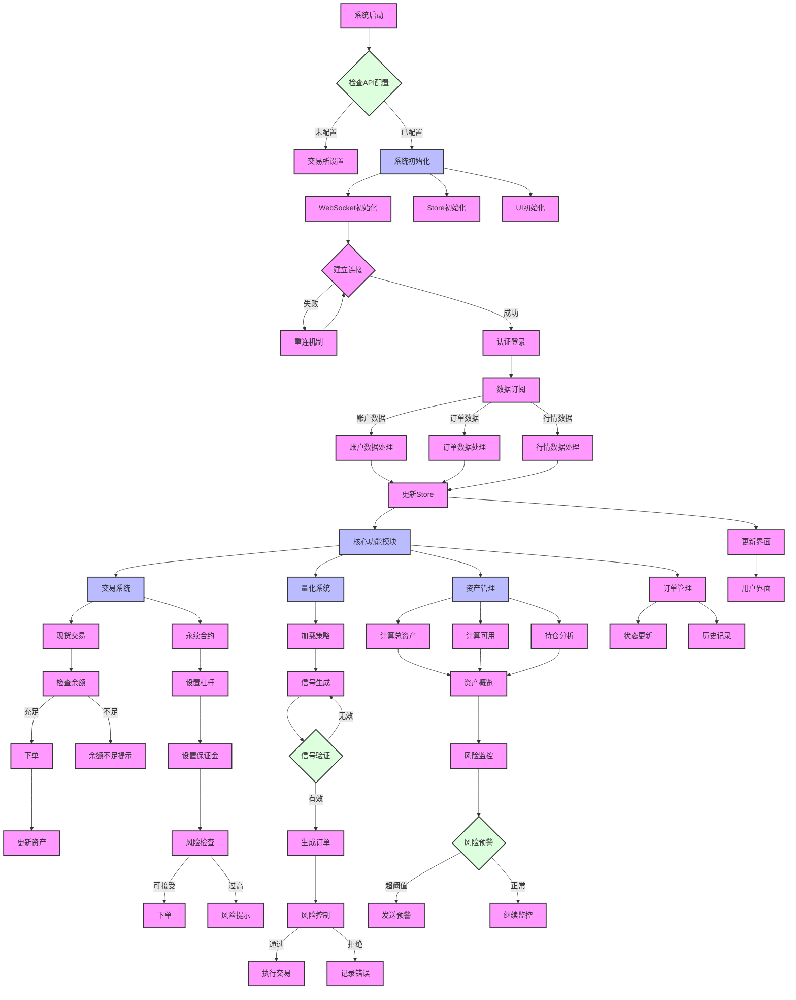

# 交易系统架构

```mermaid
graph TB
    %% 主系统入口
    Start[系统启动] --> CheckConfig{检查API配置}
    CheckConfig -->|未配置| SetupAPI[交易所设置]
    CheckConfig -->|已配置| InitSystem[系统初始化]
    
    %% 系统初始化
    InitSystem --> InitWS[WebSocket初始化]
    InitSystem --> InitStore[Store初始化]
    InitSystem --> InitUI[UI初始化]
    
    %% WebSocket模块
    InitWS --> WSConnect{建立连接}
    WSConnect -->|失败| Retry[重连机制]
    Retry --> WSConnect
    WSConnect -->|成功| WSAuth[认证登录]
    WSAuth --> SubData[数据订阅]
    
    SubData --> |账户数据| AccData[账户数据处理]
    SubData --> |订单数据| OrderData[订单数据处理]
    SubData --> |行情数据| MarketData[行情数据处理]
    
    %% 数据存储层
    AccData --> StoreUpdate[更新Store]
    OrderData --> StoreUpdate
    MarketData --> StoreUpdate
    
    %% 核心功能模块
    StoreUpdate --> CoreModules[核心功能模块]
    
    %% 交易模块
    CoreModules --> TradingSystem[交易系统]
    TradingSystem --> SpotTrading[现货交易]
    TradingSystem --> FuturesTrading[永续合约]
    
    %% 现货交易流程
    SpotTrading --> CheckBalance[检查余额]
    CheckBalance -->|充足| PlaceSpotOrder[下单]
    CheckBalance -->|不足| BalanceError[余额不足提示]
    PlaceSpotOrder --> UpdateAssets[更新资产]
    
    %% 合约交易流程
    FuturesTrading --> SetLeverage[设置杠杆]
    SetLeverage --> SetMargin[设置保证金]
    SetMargin --> RiskCheck[风险检查]
    RiskCheck -->|可接受| PlaceFuturesOrder[下单]
    RiskCheck -->|过高| RiskError[风险提示]
    
    %% 量化交易模块
    CoreModules --> QuantSystem[量化系统]
    QuantSystem --> LoadStrategy[加载策略]
    LoadStrategy --> SignalGen[信号生成]
    SignalGen --> SignalValid{信号验证}
    SignalValid -->|有效| GenOrder[生成订单]
    SignalValid -->|无效| SignalGen
    GenOrder --> RiskControl[风险控制]
    RiskControl -->|通过| ExecTrade[执行交易]
    RiskControl -->|拒绝| LogError[记录错误]
    
    %% 资产管理模块
    CoreModules --> AssetManagement[资产管理]
    AssetManagement --> CalcTotal[计算总资产]
    AssetManagement --> CalcAvailable[计算可用]
    AssetManagement --> PositionAnalysis[持仓分析]
    
    CalcTotal --> AssetOverview[资产概览]
    CalcAvailable --> AssetOverview
    PositionAnalysis --> AssetOverview
    
    AssetOverview --> RiskMonitor[风险监控]
    RiskMonitor --> RiskAlert{风险预警}
    RiskAlert -->|超阈值| SendAlert[发送预警]
    RiskAlert -->|正常| Continue[继续监控]
    
    %% 订单管理
    CoreModules --> OrderManagement[订单管理]
    OrderManagement --> OrderStatus[状态更新]
    OrderManagement --> OrderHistory[历史记录]
    
    %% UI更新
    StoreUpdate --> UpdateUI[更新界面]
    UpdateUI --> UserInterface[用户界面]
    
    %% 样式说明
    classDef default fill:#f9f,stroke:#333,stroke-width:2px;
    classDef process fill:#bbf,stroke:#333,stroke-width:2px;
    classDef decision fill:#dfd,stroke:#333,stroke-width:2px;
    
    class CheckConfig,SignalValid,RiskAlert decision;
    class Start default;
    class InitSystem,CoreModules,TradingSystem,QuantSystem,AssetManagement process;
```